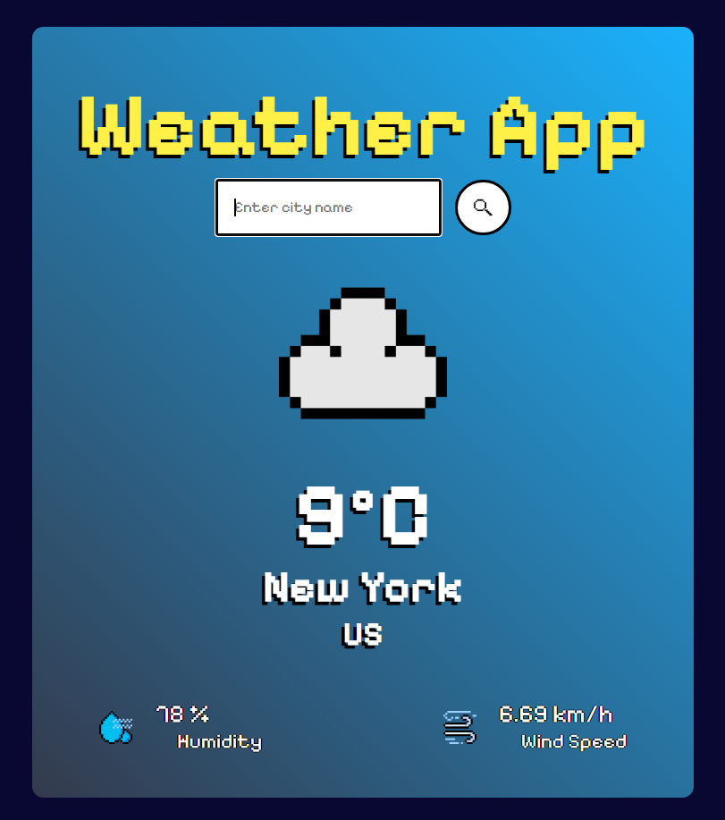

# Pixel Weather App 🎮

A retro pixel art themed weather app built with React. 
Get real-time weather data for any city in the world.

## Live Demo
[View Live App](https://weather-app-git-main-ashishs-projects-1f399ab3.vercel.app/)

## Features
- Real-time weather data from OpenWeatherMap API
- Dynamic background that changes based on weather condition
- Pixel art theme with custom weather icons
- Search any city worldwide
- Displays temperature, humidity, and wind speed
- Enter key and button search support

## Built With
- React
- Vite
- OpenWeatherMap API
- CSS3

## Screenshots

## Getting Started
1. Clone the repo
2. Run `npm install`
3. Create a `.env` file and add your OpenWeatherMap API key:
VITE_WEATHER_API_KEY=your_key_here
4. Run `npm run dev`
